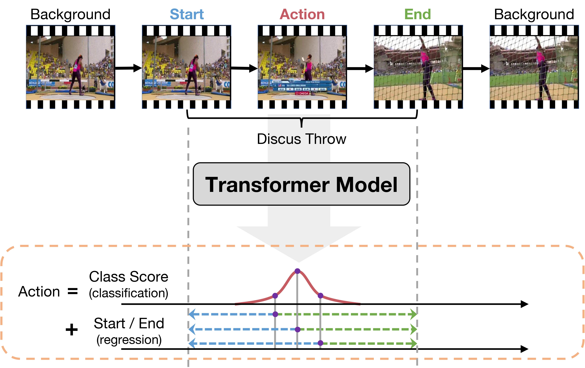

# ActionFormer: Localizing Moments of Actions with Transformers

## Introduction
This code repo implements Actionformer, one of the first Transformer-based model for temporal action localization --- detecting the onsets and offsets of action instances and recognizing their action categories. Without bells and whistles, ActionFormer achieves 71.0% mAP at tIoU=0.5 on THUMOS14, outperforming the best prior model by 14.1 absolute percentage points and crossing the 60% mAP for the first time. Further, ActionFormer demonstrates strong results on ActivityNet 1.3 (36.56% average mAP) and the more challenging EPIC-Kitchens 100 (+13.5% average mAP over prior works). Our paper is accepted to ECCV 2022 and an arXiv version can be found at [this link](https://arxiv.org/abs/2202.07925).

In addition, ActionFormer is the backbone for many winning solutions in the Ego4D Moment Queries Challenge 2022. Our submission in particular is ranked 2nd with a record 21.76% average mAP and 42.54% Recall@1x, tIoU=0.5, nearly three times higher than the official baseline. An arXiv version of our tech report can be found at [this link](https://arxiv.org/abs/2211.09074). We invite our audience to try out the code.

<div align="center">
  
</div>

Specifically, we adopt a minimalist design and develop a Transformer based model for temporal action localization, inspired by the recent success of Transformers in NLP and vision. Our method, illustrated in the figure, adapts local self-attention to model temporal context in untrimmed videos, classifies every moment in an input video, and regresses their corresponding action boundaries. The result is a deep model that is trained using standard classification and regression loss, and can localize moments of actions in a single shot, without using action proposals or pre-defined anchor windows.

**Related projects**:
> [**SnAG: Scalable and Accurate Video Grounding**](https://arxiv.org/abs/2404.02257) <br>
> Fangzhou Mu\*, Sicheng Mo\*, Yin Li <br>
> *CVPR 2024* <br>
[](https://github.com/fmu2/snag_release)  [](https://github.com/fmu2/snag_release)  [](https://arxiv.org/abs/2404.02257) <br>

## Changelog
* 11/18/2022: We have released the [tech report](https://arxiv.org/abs/2211.09074) for our submission to the [Ego4D Moment Queries (MQ) Challenge](https://eval.ai/web/challenges/challenge-page/1626/overview). The code repo now includes config files, pre-trained models and results on the Ego4D MQ benchmark.

* 08/29/2022: Updated arXiv version.

* 08/01/2022: Updated code repo with latest results on ActivityNet.

* 07/08/2022: The paper is accepted to ECCV 2022.

* 05/09/2022: Pre-trained models have been updated.

* 05/08/2022: We have updated the code repo based on the community feedback and our code review, leading to significantly better average mAP on THUMOS14 (>66.0%) and slightly improved results on ActivityNet and EPIC-Kitchens 100.


## Code Overview
The structure of this code repo is heavily inspired by Detectron2. Some of the main components are
* ./libs/core: Parameter configuration module.
* ./libs/datasets: Data loader and IO module.
* ./libs/modeling: Our main model with all its building blocks.
* ./libs/utils: Utility functions for training, inference, and postprocessing.

## Installation
* Follow INSTALL.md for installing necessary dependencies and compiling the code.

## Frequently Asked Questions
* See FAQ.md.


## To Reproduce Our Results on THUMOS14
**Download Features and Annotations**
* Download *thumos.tar.gz* (`md5sum 375f76ffbf7447af1035e694971ec9b2`) from [this Box link](https://uwmadison.box.com/s/glpuxadymf3gd01m1cj6g5c3bn39qbgr) or [this Google Drive link](https://drive.google.com/file/d/1zt2eoldshf99vJMDuu8jqxda55dCyhZP/view?usp=sharing) or [this BaiduYun link](https://pan.baidu.com/s/1TgS91LVV-vzFTgIHl1AEGA?pwd=74eh).
* The file includes I3D features, action annotations in json format (similar to ActivityNet annotation format), and external classification scores.

**Details**: The features are extracted from two-stream I3D models pretrained on Kinetics using clips of `16 frames` at the video frame rate (`~30 fps`) and a stride of `4 frames`. This gives one feature vector per `4/30 ~= 0.1333` seconds.

**Unpack Features and Annotations**
* Unpack the file under *./data* (or elsewhere and link to *./data*).
* The folder structure should look like
```
This folder
│   README.md
│   ...  
│
└───data/
│    └───thumos/
│    │	 └───annotations
│    │	 └───i3d_features   
│    └───...
|
└───libs
│
│   ...
```

**Training and Evaluation**
* Train our ActionFormer with I3D features. This will create an experiment folder under *./ckpt* that stores training config, logs, and checkpoints.
```shell
python ./train.py ./configs/thumos_i3d.yaml --output reproduce
```
* [Optional] Monitor the training using TensorBoard
```shell
tensorboard --logdir=./ckpt/thumos_i3d_reproduce/logs
```
* Evaluate the trained model. The expected average mAP should be around 62.6(%) as in Table 1 of our main paper. **With recent commits, the expected average mAP should be higher than 66.0(%)**.
```shell
python ./eval.py ./configs/thumos_i3d.yaml ./ckpt/thumos_i3d_reproduce
```
* Training our model on THUMOS requires ~4.5GB GPU memory, yet the inference might require over 10GB GPU memory. We recommend using a GPU with at least 12 GB of memory.

**[Optional] Evaluating Our Pre-trained Model**

We also provide a pre-trained model for THUMOS 14. The model with all training logs can be downloaded from [this Google Drive link](https://drive.google.com/file/d/1isG3bc1dG5-llBRFCivJwz_7c_b0XDcY/view?usp=sharing). To evaluate the pre-trained model, please follow the steps listed below.

* Create a folder *./pretrained* and unpack the file under *./pretrained* (or elsewhere and link to *./pretrained*).
* The folder structure should look like
```
This folder
│   README.md
│   ...  
│
└───pretrained/
│    └───thumos_i3d_reproduce/
│    │	 └───thumos_reproduce_log.txt
│    │	 └───thumos_reproduce_results.txt
│    │   └───...    
│    └───...
|
└───libs
│
│   ...
```
* The training config is recorded in *./pretrained/thumos_i3d_reproduce/config.txt*.
* The training log is located at *./pretrained/thumos_i3d_reproduce/thumos_reproduce_log.txt* and also *./pretrained/thumos_i3d_reproduce/logs*.
* The pre-trained model is *./pretrained/thumos_i3d_reproduce/epoch_034.pth.tar*.
* Evaluate the pre-trained model.
```shell
python ./eval.py ./configs/thumos_i3d.yaml ./pretrained/thumos_i3d_reproduce/
```
* The results (mAP at tIoUs) should be

| Method            |  0.3  |  0.4  |  0.5  |  0.6  |  0.7  |  Avg  |
|-------------------|-------|-------|-------|-------|-------|-------|
| ActionFormer      | 82.13 | 77.80 | 70.95 | 59.40 | 43.87 | 66.83 |


## To Reproduce Our Results on ActivityNet 1.3
**Download Features and Annotations**
* Download *anet_1.3.tar.gz* (`md5sum c415f50120b9425ee1ede9ac3ce11203`) from [this Box link](https://uwmadison.box.com/s/aisdoymowukc99zoc7gpqegxbb4whikx) or [this Google Drive Link](https://drive.google.com/file/d/1VW8px1Nz9A17i0wMVUfxh6YsPCLVqL-S/view?usp=sharing) or [this BaiduYun Link](https://pan.baidu.com/s/1tw5W8B5YqDvfl-mrlWQvnQ?pwd=xuit).
* The file includes TSP features, action annotations in json format (similar to ActivityNet annotation format), and external classification scores.

**Details**: The features are extracted from the R(2+1)D-34 model pretrained with TSP on ActivityNet using clips of `16 frames` at a frame rate of `15 fps` and a stride of `16 frames` (*i.e.,* **non-overlapping** clips). This gives one feature vector per `16/15 ~= 1.067` seconds. The features are converted into numpy files for our code.

**Unpack Features and Annotations**
* Unpack the file under *./data* (or elsewhere and link to *./data*).
* The folder structure should look like
```
This folder
│   README.md
│   ...  
│
└───data/
│    └───anet_1.3/
│    │	 └───annotations
│    │	 └───tsp_features   
│    └───...
|
└───libs
│
│   ...
```

**Training and Evaluation**
* Train our ActionFormer with TSP features. This will create an experiment folder under *./ckpt* that stores training config, logs, and checkpoints.
```shell
python ./train.py ./configs/anet_tsp.yaml --output reproduce
```
* [Optional] Monitor the training using TensorBoard
```shell
tensorboard --logdir=./ckpt/anet_tsp_reproduce/logs
```
* Evaluate the trained model. The expected average mAP should be around 36.5(%) as in Table 1 of our main paper.
```shell
python ./eval.py ./configs/anet_tsp.yaml ./ckpt/anet_tsp_reproduce
```
* Training our model on ActivityNet requires ~4.6GB GPU memory, yet the inference might require over 10GB GPU memory. We recommend using a GPU with at least 12 GB of memory.

**[Optional] Evaluating Our Pre-trained Model**

We also provide a pre-trained model for ActivityNet 1.3. The model with all training logs can be downloaded from [this Google Drive link](https://drive.google.com/file/d/1JKh3w14ngAjgzuuP22BnjhkhIcBSqteJ/view?usp=sharing). To evaluate the pre-trained model, please follow the steps listed below.

* Create a folder *./pretrained* and unpack the file under *./pretrained* (or elsewhere and link to *./pretrained*).
* The folder structure should look like
```
This folder
│   README.md
│   ...  
│
└───pretrained/
│    └───anet_tsp_reproduce/
│    │	 └───anet_tsp_reproduce_log.txt
│    │	 └───anet_tsp_reproduce_results.txt
│    │   └───...    
│    └───...
|
└───libs
│
│   ...
```
* The training config is recorded in *./pretrained/anet_tsp_reproduce/config.txt*.
* The training log is located at *./pretrained/anet_tsp_reproduce/anet_tsp_reproduce_log.txt* and also *./pretrained/anet_tsp_reproduce/logs*.
* The pre-trained model is *./pretrained/anet_tsp_reproduce/epoch_014.pth.tar*.
* Evaluate the pre-trained model.
```shell
python ./eval.py ./configs/anet_tsp.yaml ./pretrained/anet_tsp_reproduce/
```
* The results (mAP at tIoUs) should be

| Method            |  0.5  |  0.75 |  0.95 |  Avg  |
|-------------------|-------|-------|-------|-------|
| ActionFormer      | 54.67 | 37.81 |  8.36 | 36.56 |


**[Optional] Reproducing Our Results with I3D Features**

* Download *anet_1.3_i3d.tar.gz* (`md5sum e649425954e0123401650312dd0d56a7`) from [this Google Drive Link](https://drive.google.com/file/d/16239kUT2Z-j6S6PXIT1b_31OJi35QW_o/view?usp=sharing).

**Details**: The features are extracted from the I3D model pretrained on Kinetics using clips of `16 frames` at a frame rate of `25 fps` and a stride of `16 frames`. This gives one feature vector per `16/25 = 0.64` seconds. The features are converted into numpy files for our code.

* Unpack the file under *./data* (or elsewhere and link to *./data*), similar to TSP features.

* Train our ActionFormer with I3D features. This will create an experiment folder under *./ckpt* that stores training config, logs, and checkpoints.
```shell
python ./train.py ./configs/anet_i3d.yaml --output reproduce
```

* Evaluate the trained model. The expected average mAP should be around 36.0(%). This is slightly improved from our paper. The improvement is produced by better training scheme / hyperparameters (see comments in the config file).
```shell
python ./eval.py ./configs/anet_i3d.yaml ./ckpt/anet_i3d_reproduce
```

* The pre-trained model with all training logs can be downloaded from [this Google Drive link](https://drive.google.com/file/d/152dw2JDoNPssSnaQDaNolQUSFgcHlxe3/view?usp=sharing). To produce the results, create a folder *./pretrained*, unpack the file under *./pretrained* (or elsewhere and link to *./pretrained*), and run
```shell
python ./eval.py ./configs/anet_i3d.yaml ./pretrained/anet_i3d_reproduce/
```

* The results (mAP at tIoUs) with I3D features should be

| Method            |  0.5  |  0.75 |  0.95 |  Avg  |
|-------------------|-------|-------|-------|-------|
| ActionFormer      | 54.29 | 36.71 |  8.24 | 36.03 |

## To Reproduce Our Results on EPIC Kitchens 100
**Download Features and Annotations**
* Download *epic_kitchens.tar.gz* (`md5sum add9803756afd9a023bc9a9c547e0229`) from [this Box link](https://uwmadison.box.com/s/vdha47qnce6jhqktz9g4mq1gc40w82yj) or [this Google Drive Link](https://drive.google.com/file/d/1Z4U_dLuu6_cV5NBIrSzsSDOOj2Uar85X/view?usp=sharing) or [this BaiduYun Link](https://pan.baidu.com/s/15tOdX6Yp4AJ9lFGjbQ8dgg?pwd=f3tx).
* The file includes SlowFast features as well as action annotations in json format (similar to ActivityNet annotation format).

**Details**: The features are extracted from the SlowFast model pretrained on the training set of EPIC Kitchens 100 (action classification) using clips of `32 frames` at a frame rate of `30 fps` and a stride of `16 frames`. This gives one feature vector per `16/30 ~= 0.5333` seconds.

**Unpack Features and Annotations**
* Unpack the file under *./data* (or elsewhere and link to *./data*).
* The folder structure should look like
```
This folder
│   README.md
│   ...  
│
└───data/
│    └───epic_kitchens/
│    │	 └───annotations
│    │	 └───features   
│    └───...
|
└───libs
│
│   ...
```

**Training and Evaluation**
* On EPIC Kitchens, we train separate models for nouns and verbs.
* To train our ActionFormer on verbs with SlowFast features, use
```shell
python ./train.py ./configs/epic_slowfast_verb.yaml --output reproduce
```
* To train our ActionFormer on nouns with SlowFast features, use
```shell
python ./train.py ./configs/epic_slowfast_noun.yaml --output reproduce
```
* Evaluate the trained model for verbs. The expected average mAP should be around 23.4(%) as in Table 2 of our main paper.
```shell
python ./eval.py ./configs/epic_slowfast_verb.yaml ./ckpt/epic_slowfast_verb_reproduce
```
* Evaluate the trained model for nouns. The expected average mAP should be around 21.9(%) as in Table 2 of our main paper.
```shell
python ./eval.py ./configs/epic_slowfast_noun.yaml ./ckpt/epic_slowfast_noun_reproduce
```
* Training our model on EPIC Kitchens requires ~4.5GB GPU memory, yet the inference might require over 10GB GPU memory. We recommend using a GPU with at least 12 GB of memory.

**[Optional] Evaluating Our Pre-trained Model**

We also provide a pre-trained model for EPIC-Kitchens 100. The model with all training logs can be downloaded from [this Google Drive link](https://drive.google.com/file/d/1Ta4ggKSj2YcszSrDbePlHe1ECF1CFKK4/view?usp=sharing) (verb), and from this [Google Drive link](https://drive.google.com/file/d/1OTlxeiWj8JE9n1-LsRYogHmqgUdsE5PR/view?usp=sharing) (noun). To evaluate the pre-trained model, please follow the steps listed below.

* Create a folder *./pretrained* and unpack the file under *./pretrained* (or elsewhere and link to *./pretrained*).
* The folder structure should look like
```
This folder
│   README.md
│   ...  
│
└───pretrained/
│    └───epic_slowfast_verb_reproduce/
│    │	 └───epic_slowfast_verb_reproduce_log.txt
│    │	 └───epic_slowfast_verb_reproduce_results.txt
│    │   └───...   
│    └───epic_slowfast_noun_reproduce/
│    │	 └───epic_slowfast_noun_reproduce_log.txt
│    │	 └───epic_slowfast_noun_reproduce_results.txt
│    │   └───...  
│    └───...
|
└───libs
│
│   ...
```
* The training config is recorded in *./pretrained/epic_slowfast_(verb|noun)_reproduce/config.txt*.
* The training log is located at *./pretrained/epic_slowfast_(verb|noun)_reproduce/epic_slowfast_(verb|noun)_reproduce_log.txt* and also *./pretrained/epic_slowfast_(verb|noun)_reproduce/logs*.
* The pre-trained model is *./pretrained/epic_slowfast_(verb|noun)_reproduce/epoch_(020|020).pth.tar*.
* Evaluate the pre-trained model for verbs.
```shell
python ./eval.py ./configs/epic_slowfast_verb.yaml ./pretrained/epic_slowfast_verb_reproduce/
```
* Evaluate the pre-trained model for nouns.
```shell
python ./eval.py ./configs/epic_slowfast_noun.yaml ./pretrained/epic_slowfast_noun_reproduce/
```
* The results (mAP at tIoUs) should be

| Method              |  0.1  |  0.2  |  0.3  |  0.4  |  0.5  |  Avg  |
|---------------------|-------|-------|-------|-------|-------|-------|
| ActionFormer (verb) | 26.58 | 25.42 | 24.15 | 22.29 | 19.09 | 23.51 |
| ActionFormer (noun) | 25.21 | 24.11 | 22.66 | 20.47 | 16.97 | 21.88 |

## To Reproduce Our Results on Ego4D Moment Queries Benchmark
**Download Features and Annotations**
* Download the official SlowFast and Omnivore features from [the Ego4D website](https://ego4d-data.org/#download) and the official EgoVLP features from [this link](https://github.com/showlab/EgoVLP/issues/1#issuecomment-1219076014). Please note that we are not authorized to release the features and annotations. Instead, we provide our script for feature and annotation conversion at `./tools/convert_ego4d_trainval.py`.

**Details**: All features are extracted at `1.875 fps` from videos at `30 fps`. This gives one feature vector per `~0.5333` seconds. Please refer to Ego4D and EgoVLP's documentation for more details on feature extraction.

**Unpack Features and Annotations**
* Unpack the file under *./data* (or elsewhere and link to *./data*).
* The folder structure should look like
```
This folder
│   README.md
│   ...  
│
└───data/
│    └───ego4d/
│    │   └───annotations
│    │   └───slowfast_features
│    │   └───omnivore_features
│    │   └───egovlp_features  
│    └───...
|
└───libs
│
│   ...
```

**Training and Evaluation**
* We provide config files for training ActionFormer with different feature combinations. For example, training on Omnivore and EgoVLP features will create an experiment folder under *./ckpt* that stores training config, logs, and checkpoints.
```shell
python ./train.py ./configs/ego4d_omnivore_egovlp.yaml --output reproduce
```
* [Optional] Monitor the training using TensorBoard
```shell
tensorboard --logdir=./ckpt/ego4d_omnivore_egovlp_reproduce/logs
```
* Evaluate the trained model. The expected average mAP and Recall@1x, tIoU=0.5 should be around 22.0(%) and 40.0(%) respectively.
```shell
python ./eval.py ./configs/ego4d_omnivore_egovlp.yaml ./ckpt/ego4d_omnivore_egovlp_reproduce
```
* Training our model on Ego4D with all three features requires ~4.5GB GPU memory, yet the inference might require over 10GB GPU memory. We recommend using a GPU with at least 12 GB of memory.

**[Optional] Evaluating Our Pre-trained Model**

We also provide pre-trained models for Ego4D trained with all feature combinations. The models with all training logs can be downloaded from [this Google Drive link](https://drive.google.com/drive/folders/1NpAECS0ZhcCuehXkF9OhLQDPFrNdStJb?usp=sharing). To evaluate the pre-trained model, please follow the steps listed below.

* Create a folder *./pretrained* and unpack the file under *./pretrained* (or elsewhere and link to *./pretrained*).
* An example of the folder structure should look like
```
This folder
│   README.md
│   ...  
│
└───pretrained/
│    └───ego4d_omnivore_egovlp_reproduce/
│    │   └───ego4d_omnivore_egovlp_reproduce_log.txt
│    │   └───ego4d_omnivore_egovlp_reproduce_results.txt
│    │   └───...   
│    └───...
|
└───libs
│
│   ...
```
* The training config is recorded in *./pretrained/ego4d_omnivore_egovlp_reproduce/config.txt*.
* The training log is located at *./pretrained/ego4d_omnivore_egovlp_reproduce/ego4d_omnivore_egovlp_reproduce_log.txt* and also *./pretrained/ego4d_omnivore_egovlp_reproduce/logs*.
* The pre-trained model is *./pretrained/ego4d_omnivore_egovlp_reproduce/epoch_010.pth.tar*.
* Evaluate the pre-trained model.
```shell
python ./eval.py ./configs/ego4d_omnivore_egovlp.yaml ./pretrained/ego4d_omnivore_egovlp_reproduce/
```
* The results (mAP at tIoUs) should be

| Method                |  0.1  |  0.2  |  0.3  |  0.4  |  0.5  |  Avg  |
|-----------------------|-------|-------|-------|-------|-------|-------|
| ActionFormer (S)      | 20.09 | 17.45 | 14.44 | 12.46 | 10.00 | 14.89 |
| ActionFormer (O)      | 23.87 | 20.78 | 18.39 | 15.33 | 12.65 | 18.20 |
| ActionFormer (E)      | 26.84 | 23.86 | 20.57 | 17.19 | 14.54 | 20.60 |
| ActionFormer (S+E)    | 27.98 | 24.46 | 21.21 | 18.56 | 15.60 | 21.56 |
| ActionFormer (O+E)    | 27.99 | 24.94 | 21.94 | 19.05 | 15.98 | 21.98 |
| ActionFormer (S+O+E)  | 28.26 | 24.69 | 21.88 | 19.35 | 16.28 | 22.09 |

* The results (Recall@1x at tIoUs) should be

| Method                |  0.1  |  0.2  |  0.3  |  0.4  |  0.5  |  Avg  |
|-----------------------|-------|-------|-------|-------|-------|-------|
| ActionFormer (S)      | 52.25 | 45.84 | 40.60 | 36.58 | 31.33 | 41.32 |
| ActionFormer (O)      | 54.63 | 48.72 | 43.03 | 37.76 | 33.57 | 43.54 |
| ActionFormer (E)      | 59.53 | 54.39 | 48.97 | 42.75 | 37.12 | 48.55 |
| ActionFormer (S+E)    | 59.96 | 53.75 | 48.76 | 44.00 | 38.96 | 49.09 |
| ActionFormer (O+E)    | 61.03 | 54.15 | 49.79 | 45.17 | 39.88 | 49.99 |
| ActionFormer (S+O+E)  | 60.85 | 54.16 | 49.60 | 45.12 | 39.87 | 49.92 |

## Self-Supervised Post-Training (NeCo-style)
This repo has been extended with an *add-on* for self-supervised post-training of the ActionFormer encoder, following [NeCo](https://arxiv.org/abs/2408.11054) ("NeCo: Improving DINOv2's Spatial Representations with Patch Neighbor Consistency", Pariza et al.), adapted from spatial (2D) crops and 2D ROI-Align to **temporal (1D) crops** and a **1D ROI-Align**. The original supervised training / evaluation code is untouched.

**Idea.** For every video we sample *two temporal crops* (views) that are guaranteed to overlap. View 1 is encoded by the *student*, view 2 by an *EMA teacher* (momentum follows a cosine schedule from `0.9995` to `1.0`, NeCo/DINOv2 style). Both multi-scale FPN feature maps are projected position-wise, aligned onto the shared crop-intersection (the temporal ROI) with a 1D ROI-Align (bilinear interpolation into `n_bins` temporal bins), and fused across scales. A SoftSort-based *differentiable* ranking (SoftSort, NeurIPS 2020) produces, for every ROI bin, a soft permutation over a *reference pool* built from the valid bins of the *other* videos in the batch (student features, stop-gradient). The loss enforces that the nearest-neighbor ordering from the student view matches the teacher view (cross entropy on the soft permutations, both directions). No labels are required, so unlabeled videos can be used.

**New files**
* `libs/datasets/ssl.py` — `SelfSupDataset` (registered as `"sslv1"`): generic video enumeration from a json db, feature loading (`.npy` / `.npz[feats]`), random temporal-window sampling (capped at `max_seq_len`), and `sample_temporal_crops` (guaranteed-overlap two-crop sampler).
* `libs/modeling/selfsup.py` — core SSL module: `temporal_roi_align`, `SSLProjectionHead` (per-level shared MLP + optional multi-scale mixer), `soft_sort_perm`, `NeCoLoss`, and the `PtTransformerSSL` meta-arch (registered as `"PtTransformerSSL"`; backbone + neck identical to the supervised model, so encoder weights transfer), plus `make_ssl_optimizer` (projection head trains at `head_lr_scale` x encoder lr) and `ema_momentum_schedule`.
* `train_ssl.py` — SSL training / validation script.
* `train_ssl.slurm` — example SLURM job script (ALICE cluster, `thesis_env`).
* `configs/ssl_thumos_i3d.yaml`, `configs/ssl_epic_slowfast_verb.yaml`, `configs/ssl_epic_vjepa2_verb.yaml`.

**How views are formed.** Each view is sliced from the video's feature grid (raw coordinates), zero-padded to a multiple of `max_div_factor` (e.g. `576` for `n_mha_win_size: 19`, `256` for `n_mha_win_size: 9`, required by the multi-scale / local-attention transformer), and capped at `max_seq_len`. A bool `(B, 1, P)` mask is carried through the encoder (masked convs / masked attention). Per FPN level, the ROI is converted to the level's coordinate system via `/stride`, where `stride = 2^(level + fpn_start_level)` for the `identity` neck and `1.0` for the `fpn` neck.

**Training.** Requires `batch_size >= 2` (reference pool from other videos).
```shell
# manual
python ./train_ssl.py ./configs/ssl_epic_slowfast_verb.yaml --output neco
python ./train_ssl.py ./configs/ssl_epic_vjepa2_verb.yaml --output neco_vjepa2
# on the cluster
sbatch train_ssl.slurm
```
Warm-start the encoder from a supervised (or previous SSL) checkpoint; only `backbone.*` / `neck.*` weights are copied, the projection `head.*` keeps its random init:
```shell
python ./train_ssl.py ./configs/ssl_epic_slowfast_verb.yaml \
    --init-encoder ./ckpt/epic_slowfast_verb_reproduce/model_best.pth.tar --output neco_warm
```
Monitor with TensorBoard (`train/final_loss`, `train/neco_top1_agreement`, `train/learning_rate`, `train/ema_momentum`, `validation/*`).

**Loss dispatch.** `make_ssl_loss(method, ssl_cfg)` returns the `neco` loss and reserves `dino`, `byol`, `masked` behind `SUPPORTED_SSL_METHODS` (raise `NotImplementedError`) so future objectives can be added without touching the training loop. Select at runtime with `--ssl-method {neco,dino,byol,masked}` (default from `cfg['ssl']['method']`).

**Fine-tuning.** Checkpoints store the EMA teacher in `state_dict_ema` (plus student `state_dict`, `optimizer`, `scheduler`). To fine-tune supervised downstream, load the EMA weights into `LocPointTransformer` (keys match; drop the extra `head.*` parameters). This is the same path used by `--init-encoder` in reverse.

## Training and Evaluating Your Own Dataset
Work in progress. Stay tuned.

## Contact
Yin Li (yin.li@wisc.edu)

## References
If you are using our code, please consider citing our paper.
```
@inproceedings{zhang2022actionformer,
  title={ActionFormer: Localizing Moments of Actions with Transformers},
  author={Zhang, Chen-Lin and Wu, Jianxin and Li, Yin},
  booktitle={European Conference on Computer Vision},
  series={LNCS},
  volume={13664},
  pages={492-510},
  year={2022}
}
```

If you cite our results on Ego4D, please consider citing our tech report in addition to the main paper.
```
@article{mu2022actionformerego4d,
  title={Where a Strong Backbone Meets Strong Features -- ActionFormer for Ego4D Moment Queries Challenge},
  author={Mu, Fangzhou and Mo, Sicheng and Wang, Gillian, and Li, Yin},
  journal={arXiv e-prints},
  year={2022}
}
```

If you are using TSP features, please cite
```
@inproceedings{alwassel2021tsp,
  title={{TSP}: Temporally-sensitive pretraining of video encoders for localization tasks},
  author={Alwassel, Humam and Giancola, Silvio and Ghanem, Bernard},
  booktitle={Proceedings of the IEEE/CVF International Conference on Computer Vision Workshops},
  pages={3173--3183},
  year={2021}
}
```
