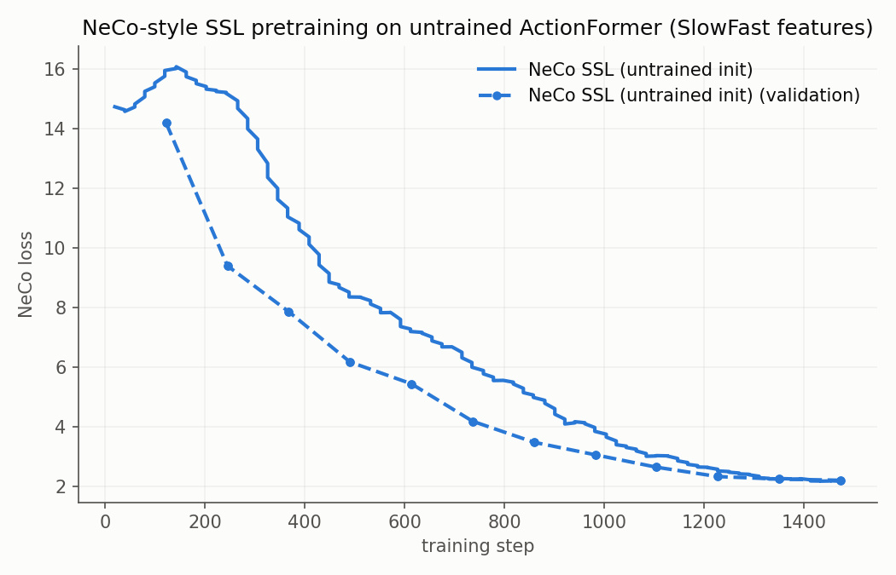
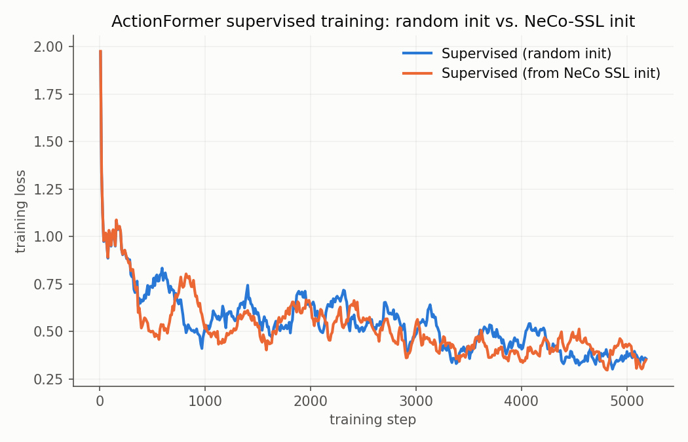

# Self-Supervised Pre/Post-Training for Temporal Action Localization with ActionFormer

*Last updated: 2026-09-25 (V-JEPA2 pipeline 3 and VideoMAE-L baseline added). Paths below are relative to `actionformer/`.*

## 1. Overview

This report documents a set of experiments on the **EPIC-KITCHENS-100 verb** task
(temporal action localization, TAL) using **ActionFormer** (Zhang et al., ECCV 2022).
The research question is whether a *NeCo-style self-supervised (SSL)* stage can
improve downstream TAL performance, measured as mAP at different temporal-IoU (tIoU)
thresholds on the validation split. Two protocols are compared:

- SSL **post-training** on top of a converged supervised model (pipeline 2, §2.3), and
- SSL **pretraining** on an untrained encoder followed by standard supervised training
  (pipeline 3, §2.5) -- the ordering used in the original NeCo/DINO-style literature.

A follow-up ablation (§2.6) fine-tunes the post-trained model with its heads unfrozen
to test *why* post-training hurts.

**Summary of findings.**

| Protocol | Avg mAP (SlowFast) | vs. baseline 23.07 |
|---|---|---|
| SSL post-training, frozen heads (pipeline 2) | 22.55 | −0.52 |
| ... + joint encoder/head fine-tune (ablation) | 22.45 | −0.62 (control: 22.97) |
| SSL pretraining → supervised training (pipeline 3) | **23.56** | **+0.49** (paper: 23.5) |

On SlowFast, SSL helps **only as an initialization** followed by a full supervised
schedule. Applied after supervised convergence it degrades the encoder, and --
contrary to the original hypothesis -- letting the heads re-adapt does not recover
the loss. The pipeline-3 gain does **not** replicate on V-JEPA2 features (17.40 vs
17.49 baseline), so it should be treated as tentative until repeated over seeds.
EPIC-finetuned VideoMAE-L features give a much stronger supervised baseline
(29.60).

Experiments were run on the ALICE cluster (Leiden University). The project mirrors the
official ActionFormer codebase with an added self-supervised training stage.

## 2. Method and Experimental Setup

### 2.1 Task, data and features

- **Dataset**: EPIC-KITCHENS-100, verb-only track, trained on `training` split
  (495 videos), evaluated on `validation` split (138 videos).
- **Features**:
  - **SlowFast**: 2304-dim features extracted with a SlowFast network pre-trained on
    EPIC-KITCHENS (official features, 30 fps, 32-frame window, feature stride 16;
    density ~1.875 vectors/sec).
  - **V-JEPA2**: 1024-dim features extracted with a frozen V-JEPA2 (ViT-L fpc32)
    backbone, density matched to SlowFast (~1.875 vectors/sec).
  - **VideoMAE-L**: 1024-dim features from a VideoMAE-L-16x4x1 backbone
    **finetuned on EPIC-KITCHENS verbs**, as released by OpenTAD (16-frame clips,
    stride 8 at 30 fps, i.e. ~3.75 vectors/sec, 2x SlowFast). Config
    `epic_videomae_verb.yaml`: identical recipe to SlowFast except `input_dim`,
    `feat_stride: 8`, `num_frames: 16` and `max_seq_len: 4608` (same temporal span).
- **Evaluation metric**: mAP at tIoU in {0.1, 0.2, 0.3, 0.4, 0.5} and the average,
  following the ActionFormer paper.

All three pipelines share the same encoder (`ConvTransformerBackbone` + identity FPN
neck, 207 parameter tensors), so encoder weights transfer between them; only the task
heads differ (SSL projection head vs. supervised cls/reg/center heads, 22 tensors).

### 2.2 Supervised baseline (pipeline 1)

Standard ActionFormer training with focal classification loss + DIoU regression loss,
center sampling, and soft-NMS inference; 16 epochs + 5 warm-up, AdamW, lr 1e-4,
batch size 2. Configs `epic_slowfast_verb.yaml` / `epic_vjepa2_verb.yaml`, final
checkpoint `epoch_021.pth.tar`.

### 2.3 Self-supervised post-training (NeCo-style, pipeline 2)

The encoder is warm-started from the supervised `epoch_021` checkpoint and then
post-trained self-supervised for 12 effective epochs (10 + 2 warm-up, batch size 4)
using a NeCo-style objective: a teacher/student EMA framework with temporal ROI
alignment over two overlapping temporal crops of each video and a SoftSort-based
neighbour-ranking loss, on the same video features (no labels).

Conjecture tested: SSL post-training of the encoder improves the representation for
downstream TAL, and thus raises mAP.

### 2.4 Downstream evaluation of the post-trained model

The SSL-trained encoder (EMA weights) is merged with the **frozen supervised**
cls/reg/center heads from `epoch_021.pth.tar` and evaluated with the standard
ActionFormer inference pipeline (`eval_ssl.py --head-from ...`; 207 encoder keys from
the SSL checkpoint, 22 head keys from the supervised checkpoint).

### 2.5 SSL pretraining then supervised training (pipeline 3)

1. **Stage A -- SSL pretraining on an untrained encoder.** `train_ssl.py` from a
   **random encoder init**, 12 effective epochs, same NeCo objective as §2.3.
2. **Stage B -- full supervised training from the SSL-pretrained encoder.**
   `train.py --init-encoder` loads only the backbone+neck weights from the SSL
   checkpoint's **EMA (teacher)** state, leaves the heads at random init, then trains
   the **entire model** with the unmodified supervised recipe (§2.2). The only
   difference from the baseline is the encoder's starting point.

Run for SlowFast and, as a second track, for V-JEPA2.

### 2.6 Joint fine-tune ablation on pipeline 2

Tests the head-mismatch explanation for pipeline 2's drop (§5.1) directly. Starting
from the *exact* pipeline-2 model (SSL post-trained EMA encoder + supervised
`epoch_021` EMA heads; `train.py --init-model <supervised> --init-encoder <ssl>`),
encoder **and** heads are fine-tuned jointly with the supervised loss, using a short
schedule suited to an already-converged model
(`configs/epic_slowfast_verb_joint_ft.yaml`: 1 warm-up + 5 cosine epochs, lr 2e-5 =
1/5 of the base lr).

A **control** runs the identical schedule from the unmodified supervised baseline
(no SSL), so the effect of extra supervised epochs is separated from the effect of
the SSL encoder.

## 3. Results

### 3.1 Main results (EPIC-100 verb, validation)

| Model | tIoU 0.1 | tIoU 0.2 | tIoU 0.3 | tIoU 0.4 | tIoU 0.5 | Avg mAP |
|---|---|---|---|---|---|---|
| Supervised baseline (SlowFast) | 26.40 | 25.15 | 23.73 | 21.70 | 18.35 | **23.07** |
| + SSL post-training, frozen heads (pipeline 2) | 26.14 | 24.70 | 23.20 | 20.93 | 17.79 | **22.55** |
| + SSL post-training + joint fine-tune (§2.6), final epoch | 26.15 | 24.78 | 23.14 | 21.21 | 17.83 | **22.45** |
| Control: baseline + same joint fine-tune, no SSL, final epoch | 26.41 | 25.16 | 23.55 | 21.52 | 18.22 | **22.97** |
| SSL pretrain → supervised (SlowFast, pipeline 3) | 26.72 | 25.63 | 24.10 | 22.37 | 18.99 | **23.56** |
| Supervised baseline (V-JEPA2) | 20.51 | 19.74 | 18.38 | 16.17 | 12.64 | **17.49** |
| SSL pretrain → supervised (V-JEPA2, pipeline 3) | 20.33 | 19.49 | 18.11 | 15.87 | 13.19 | **17.40** |
| Supervised baseline (VideoMAE-L, EPIC-finetuned) | 32.84 | 32.06 | 30.42 | 28.11 | 24.59 | **29.60** |

### 3.2 Joint fine-tune ablation, per epoch

Average mAP of the EMA model after each fine-tune epoch:

| Epoch | 1 | 2 | 3 | 4 | 5 | 6 |
|---|---|---|---|---|---|---|
| SSL post-trained + joint fine-tune | 22.48 | 22.47 | 22.52 | 22.61 | 22.60 | 22.45 |
| Control (no SSL) | 23.02 | 22.98 | 23.02 | 23.01 | 22.94 | 22.97 |

The gap to the control (~0.5 pp) is flat across all six epochs: there is no upward
trend that a longer fine-tune at this learning rate would plausibly extend.

### 3.2.1 V-JEPA2 pipeline 3 vs. baseline, per epoch

| Epoch | 1 | 5 | 10 | 15 | 20 | 21 |
|---|---|---|---|---|---|---|
| V-JEPA2 baseline (random init) | 0.07 | 5.56 | 12.53 | 16.03 | 17.40 | 17.49 |
| V-JEPA2, SSL-pretrained encoder | 0.06 | 5.54 | 12.84 | 16.24 | 17.35 | 17.40 |

The SSL-initialized run is marginally ahead mid-training (+0.2–0.3 pp at epochs
10/15) but converges to the same value; the two curves are indistinguishable at
the end.

### 3.3 SSL training signals

| Run | Encoder init | Final val NeCo loss | Final top-1 agreement |
|---|---|---|---|
| SlowFast, post-training (pipeline 2) | supervised epoch_021 | 5.59 | 0.832 |
| SlowFast, pretraining (pipeline 3, stage A) | random | 2.20 | 0.769 |
| V-JEPA2, post-training | supervised epoch_021 | 5.95 | 0.835 |
| V-JEPA2, pretraining (pipeline 3, stage A) | random | 1.77 | 0.839 |

NeCo losses are not comparable *across* encoder inits: a supervised encoder starts
with a very different feature geometry (the warm SlowFast run starts at ~17 and ends
at 5.6), so a lower loss for the random-init runs does not mean a better
representation.

### 3.4 Training-loss curves

*Pipeline 3 stage A (SlowFast): train and validation NeCo loss from random init.*

*Supervised training loss, baseline (random encoder) vs. pipeline 3 stage B
(SSL-initialized encoder).*

The two supervised loss curves are effectively indistinguishable: same starting value,
same noisy trajectory, same final training loss (~0.35). SSL pretraining does **not**
show up as a lower starting loss or faster convergence; its benefit appears only in
validation mAP (§5.2).

## 4. Comparison with ActionFormer (paper, Table 2)

ActionFormer, Table 2 (EPIC-Kitchens 100 validation set, verb task, SlowFast
features):

| Method | tIoU 0.1 | tIoU 0.2 | tIoU 0.3 | tIoU 0.4 | tIoU 0.5 | Avg mAP |
|---|---|---|---|---|---|---|
| BMN | 10.8 | 9.8 | 8.4 | 7.1 | 5.6 | 8.4 |
| G-TAD | 12.1 | 11.0 | 9.4 | 8.1 | 6.5 | 9.4 |
| ActionFormer (paper) | 26.6 | 25.4 | 24.2 | 22.3 | 19.1 | **23.5** |

### 4.1 Ours vs. paper

| Method (this work) | tIoU 0.1 | tIoU 0.2 | tIoU 0.3 | tIoU 0.4 | tIoU 0.5 | Avg mAP | Δ vs. paper |
|---|---|---|---|---|---|---|---|
| Supervised baseline (repro) | 26.40 | 25.15 | 23.73 | 21.70 | 18.35 | 23.07 | −0.43 |
| Baseline + SSL post-training | 26.14 | 24.70 | 23.20 | 20.93 | 17.79 | 22.55 | −0.95 |
| SSL pretrain → supervised (pipeline 3) | 26.72 | 25.63 | 24.10 | 22.37 | 18.99 | 23.56 | **+0.06** |
| ActionFormer paper | 26.6 | 25.4 | 24.2 | 22.3 | 19.1 | 23.5 | -- |

Notes on comparability:

- The reproduced baseline (23.07) is 0.43 pp below the paper (23.5), with closely
  matching per-threshold trends -- a typical reproduction gap (feature-extraction
  version, schedule, evaluation details).
- The OpenTAD reimplementation reports **24.93** avg mAP for ActionFormer on
  EPIC-100 verb with their own EPIC-finetuned SlowFast features, above both the
  paper and our reproduction. Absolute numbers are therefore sensitive to the exact
  feature release; comparisons within this report all use the same features and
  recipe.
- The V-JEPA2 track has no counterpart in the paper.
- The VideoMAE-L baseline (29.60) is not comparable to the paper's SlowFast number:
  its backbone was finetuned on EPIC verbs by OpenTAD. It is included as a stronger
  feature track, not as a reproduction.

## 5. Analysis

### 5.1 SSL post-training does not improve TAL performance

NeCo-style post-training on top of the supervised model **decreases** average mAP
from 23.07 to 22.55 (−0.52 pp, −2.3% relative), at every tIoU threshold, with the
largest drops at 0.4/0.5 where boundary quality matters. The SSL objective itself
converges (agreement 0.565 → 0.832, loss ~17 → 5.6), so this is a transfer problem,
not an optimization failure.

Candidate explanations considered originally:

1. **The supervised model is already converged**, and the SSL objective pulls the
   encoder toward a different solution that is worse for localization.
2. **Head mismatch**: the heads are frozen while the encoder drifts, so the decoder
   cannot compensate.
3. **Short post-training budget** (12 effective epochs).
4. **SSL convergence ≠ downstream quality**, especially for boundary regression.

Explanation 2 was initially considered the load-bearing one. §5.3 tests it and
**rules it out** as the main cause.

### 5.2 SSL pretraining followed by supervised training *does* improve TAL performance

Pipeline 3 reaches **23.56 avg mAP: +0.49 pp over the baseline and +0.06 pp over the
paper**, ahead at every tIoU threshold, including 0.4/0.5 where post-training lost
the most.

This does not show up in the supervised *training* loss (§3.4), which is
indistinguishable from the baseline's. The gain is a generalization effect -- higher
validation mAP at the same training loss -- consistent with SSL pretraining acting as
a representation prior / regularizer rather than an optimization head start.

### 5.3 Joint fine-tune ablation: head mismatch is not the explanation

If pipeline 2 lost accuracy only because the frozen heads no longer fit the drifted
encoder, then fine-tuning heads and encoder together should recover the baseline.
It does not (§3.1, §3.2):

- The SSL post-trained model stays at **22.45–22.61** throughout the fine-tune,
  i.e. at the frozen-head level (22.55).
- The control, given the same extra supervised epochs, stays at **22.94–23.02**,
  i.e. at the baseline level. Extra fine-tuning by itself neither helps nor hurts.
- The ~0.5 pp gap persists at every epoch and every tIoU threshold.

So the damage from SSL post-training lives in the **encoder itself**: within this
fine-tune budget, supervised gradients do not move it back to an equally good
solution. This leaves explanations 1 and 4 of §5.1.

It also changes how pipeline 3's gain should be read. It is not "the heads were
allowed to adapt" -- the ablation shows that alone is not enough. It is that SSL is
used as an **initialization**, followed by a *full* supervised schedule (warm-up at
the base learning rate) that can reshape the whole encoder around the task.

**Caveat.** The fine-tune was deliberately short and low-learning-rate (6 epochs at
lr 2e-5). A full-length, base-learning-rate schedule starting from the post-trained
encoder is untested; it would effectively become pipeline 3 with a different
initialization.

### 5.4 Feature track

- SlowFast features (2304-dim, EPIC pre-trained) are the stronger feature set;
  frozen V-JEPA2 features lag by ~5.6 pp (17.49 vs 23.07). V-JEPA2 is not
  EPIC-adapted, consistent with TAL features benefiting from in-domain fine-tuning.
- Feature densities are matched (~1.875 vectors/sec), so the gap is not a sampling
  artifact.
- **EPIC-finetuned VideoMAE-L features are far stronger**: 29.60 avg mAP, +6.53 pp
  over SlowFast and +12.1 pp over frozen V-JEPA2, ahead at every tIoU threshold
  with the unmodified SlowFast recipe (only feature-shape parameters changed).
  Feature quality dominates everything else in this report: the gap between
  feature sets is an order of magnitude larger than any SSL effect.
- **V-JEPA2 through pipeline 3: no gain.** 17.40 vs 17.49 (−0.09 pp). The only
  threshold where the SSL-initialized model is ahead is tIoU 0.5 (13.19 vs 12.64);
  the rest are 0.2–0.3 pp lower. The SSL stage itself converged normally (final val
  NeCo loss 1.77, agreement 0.839, §3.3).

### 5.5 Conclusions

The effect of SSL depends on the protocol:

- **SSL post-training on a converged model does not help** (22.55 vs 23.07), and
  **jointly re-training the heads does not rescue it** (22.45 vs a 22.97 control).
  The post-trained encoder is itself worse for localization.
- **SSL pretraining on an untrained encoder, followed by ordinary supervised
  training, helps on SlowFast** (23.56 vs 23.07, +0.49 pp), matching and marginally
  beating the paper's number at every tIoU threshold, with no change to the
  supervised recipe beyond the encoder's starting point.
- **The same protocol gives no gain on V-JEPA2** (17.40 vs 17.49). The pipeline-3
  effect therefore does not generalize across feature tracks, and on SlowFast it is
  a single-seed +0.49 pp result -- it should be treated as tentative.

In every run the SSL objective learns (loss falls, agreement rises). The robust
finding is the negative one: applied after supervised convergence, it moves a
task-tuned encoder away from what the task needs, and a short supervised fine-tune
does not undo that. Used as an initialization it is at worst harmless (V-JEPA2) and
at best a modest gain (SlowFast).

**Limitations.** All results are single runs with one seed. The differences under
discussion are ~0.5 pp, and the one positive SSL result did not replicate on the
second feature track. Epoch-to-epoch variation of a converged model is ~±0.05 pp
(§3.2), but seed-to-seed variance has not been measured. Repeating the baseline and
pipeline 3 with 2–3 seeds would be needed before calling the +0.49 pp gain
significant. The natural next test bed is the VideoMAE-L track, where the
baseline is strongest.

## 6. Reproducibility Notes

- All results: EPIC-100 **verb** task, validation split.
- **Supervised baselines**: `train_verb_4621944.out` (V-JEPA2, 17.49) and
  `logs/eval_1657178.out` (SlowFast, 23.07); checkpoint
  `ckpt/epic_slowfast_verb_reproduce/epoch_021.pth.tar`.
- **Pipeline 2 SSL runs**: `ssl_neco_slowfast_warm_4988444.out`,
  `ssl_neco_vjepa2_4917434.out`. Downstream eval: `eval_ssl.py
  configs/epic_slowfast_verb.yaml ckpt_ssl/ssl_epic_slowfast_verb_neco_warm/epoch_012.pth.tar
  --head-from ckpt/epic_slowfast_verb_reproduce/epoch_021.pth.tar` (job 4991145,
  48 min; 207 encoder + 22 head keys, EMA on both sides).
- **Pipeline 3, SlowFast**: stage A job 4796515 → `ckpt_ssl/ssl_epic_slowfast_verb_neco/`;
  stage B `train_verb_from_ssl.slurm` (job 5077230, 1h06m; 207 encoder keys matched,
  22 head keys random, 0 unexpected) → `ckpt/epic_slowfast_verb_from_ssl_neco/epoch_021.pth.tar`.
- **Joint fine-tune ablation**: `train_verb_ft_joint_ssl_warm.slurm` (job 5093320) and
  control `train_verb_ft_joint_ctrl.slurm` (job 5093321), 21 min each;
  `ckpt/epic_slowfast_verb_joint_ft_{ssl_warm,ctrl}/`.
- **Pipeline 3, V-JEPA2**: stage A `train_ssl_vjepa2_cold.slurm` (job 5093340, 7m45s)
  → `ckpt_ssl/ssl_epic_vjepa2_verb_neco_vjepa2_cold/`; stage B
  `train_verb_vjepa2_from_ssl.slurm` (job 5093405, 1h04; 207 encoder keys matched,
  22 missing, 0 unexpected) → `ckpt/epic_vjepa2_verb_from_ssl_neco/epoch_021.pth.tar`.
  A first attempt (job 5093341) was cancelled at epoch 15 by mistake and rerun from
  scratch; its partial output is in `ckpt/_cancelled/`.
- **VideoMAE-L baseline**: features in
  `data/epic_kitchens/features_videomae_verb/` (OpenTAD release, 700 videos);
  `train_verb_videomae.slurm` (job 5093406, 1h16) →
  `ckpt/epic_videomae_verb_reproduce/epoch_021.pth.tar`. A first attempt (job
  5093366) was likewise cancelled at epoch 5 and rerun.
- **Figures**: `figs/ssl_pretrain_loss.{png,jpg}`,
  `figs/supervised_loss_comparison.{png,jpg}`, produced by `tools/plot_loss_curves.py`.
